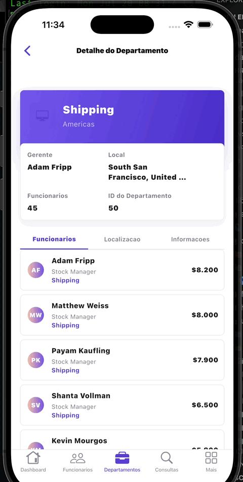

# HR Explorer

Aplicativo Flutter para explorar e consultar dados de Recursos Humanos armazenados no Firebase Cloud Firestore.

O projeto transforma o esquema relacional HR em uma estrutura NoSQL pronta para consultas, oferecendo uma interface adaptativa para Android, iOS e macOS.

<p align="center">
  
</p>

## Funcionalidades

- Dashboard com totais de funcionários, departamentos, cargos e países
- Indicadores de média salarial e maior salário
- Lista e detalhes de funcionários, com filtros por departamento e cargo
- Visualização de departamentos e seus funcionários
- Consultas rápidas com o SQL de referência e o resultado equivalente no Firestore
- Consulta de cargos, localidades, países e regiões
- Importação do conjunto de dados HR diretamente pelo aplicativo
- Interface adaptativa com componentes Material e Cupertino
- Persistência offline habilitada no Cloud Firestore

## Tecnologias

- Flutter e Dart
- Firebase Core
- Cloud Firestore
- Provider
- Firebase Admin SDK para o importador Node.js

## Estrutura do projeto

```text
lib/
├── app/                  # Configuração principal do aplicativo
├── data/                 # Modelos e repositórios
├── firebase/             # Inicialização e acesso ao Firebase
├── hr_seed/              # Importação dos dados HR pelo aplicativo
└── ui/
    ├── core/             # Tema, navegação e componentes compartilhados
    └── features/         # Dashboard, funcionários, departamentos e consultas
scripts/                  # Importador HR executado pelo Node.js
assets/hr/                # Base SQL usada na importação
```

## Pré-requisitos

- Flutter compatível com Dart `^3.12.1`
- Um projeto no Firebase com o Cloud Firestore habilitado
- Node.js e npm, caso queira executar o importador pela linha de comando

## Configuração do Firebase

### iOS

O arquivo `ios/Runner/GoogleService-Info.plist` já está configurado para o projeto Firebase `hr-oracle`.

### Android

1. Abra o projeto `hr-oracle` no Console do Firebase.
2. Cadastre um aplicativo Android com o package name `com.u2m.app_hr`.
3. Baixe o arquivo `google-services.json`.
4. Coloque-o em `android/app/google-services.json`.

O Gradle do projeto aplica automaticamente o plugin `com.google.gms.google-services` quando esse arquivo está disponível.

## Executando o aplicativo

Instale as dependências:

```sh
flutter pub get
```

Execute em um dispositivo ou emulador:

```sh
flutter run
```

## Dados HR no Firestore

O arquivo `assets/hr/hr_populate.sql` contém o conjunto de dados relacional HR. O importador resolve os relacionamentos e cria uma estrutura desnormalizada adequada ao Firestore.

Coleções geradas:

- `regions`
- `countries`
- `locations`
- `departments`
- `jobs`
- `employees`, incluindo a subcoleção `jobHistory`
- `jobHistory`, como coleção global
- `organizationSummary/global`

### Importação pelo aplicativo

Com o Firebase configurado, acesse a aba **Mais** e toque em **Importar HR para Firestore**.

### Importação pela linha de comando

Instale as dependências do importador:

```sh
npm install
```

Valide a conversão sem gravar no Firebase:

```sh
npm run import:hr:dry-run
```

Para importar os dados, autentique o Firebase Admin SDK com uma credencial local:

```sh
export GOOGLE_APPLICATION_CREDENTIALS="/caminho/para/service-account.json"
npm run import:hr
```

Para limpar os documentos principais antes de uma nova importação:

```sh
npm run import:hr -- --clear
```

> Nunca envie arquivos de credenciais ou chaves privadas para o repositório.

## Organização da interface

A navegação principal possui cinco áreas:

1. **Dashboard** — visão geral e atalhos para consultas.
2. **Funcionários** — listagem, filtros e detalhes individuais.
3. **Departamentos** — indicadores e composição das equipes.
4. **Consultas** — exemplos de consultas HR executadas no Firestore.
5. **Mais** — cargos, localidades, países, regiões e importação de dados.

## Licença

Este projeto é destinado a estudos e demonstrações com Flutter e Firebase.
